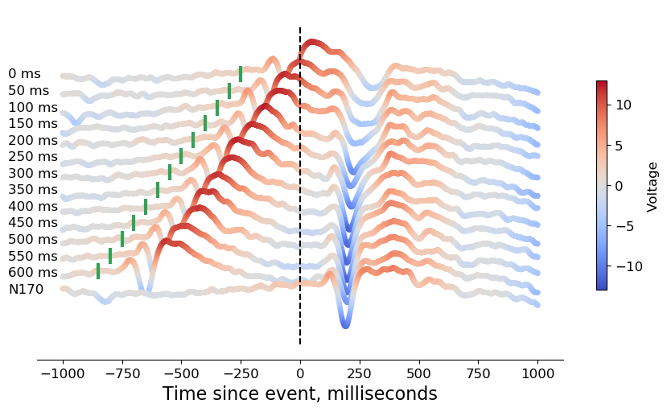
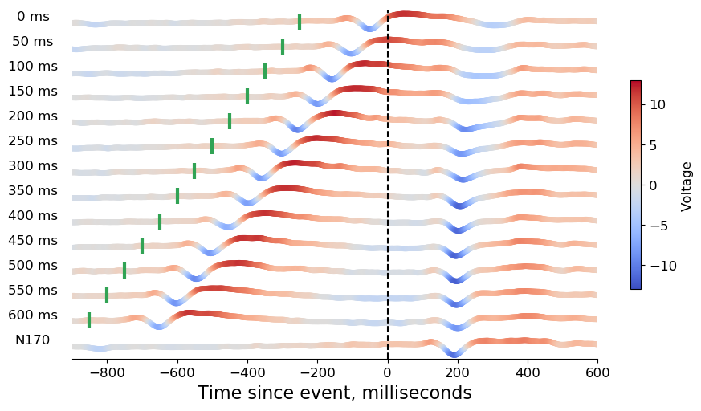
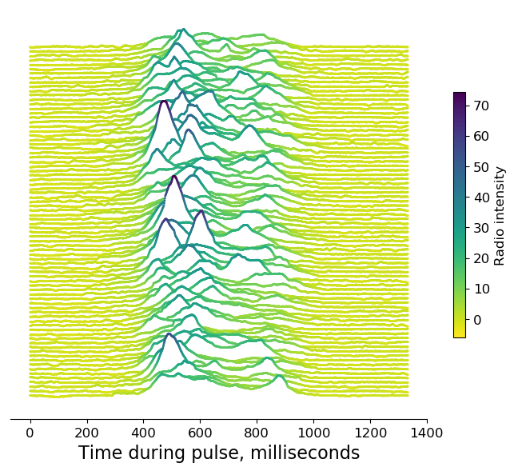

=======================
firecracker time series
=======================
How should we visualize a time series across many, discrete conditions?
Putting all the series onto a single axis can result in confusing multi-coloured spaghetti.
Stacking the series into neighbouring subplots helps but may also result in squishing.

In a `firecracker` figure, we do vertical stacking but also use colour to make up for squishing.

Specifically, we apply a colour gradient to each series that matches whatever value the time series is showing.
In other words, colour and (relative) y-axis position work together to help you perceive shape and magnitude.

We also include an option to 'layer' series so each series partially conceals the series above it.
    - the effect is aesthetically pleasing - like mountains in front of mountains
    - can free you up to show a greater vertical range for each series

Neuroscience example
====================
Neuroscientists measure ERP to study the rapid dynamics of our brain’s response to an event (like a flashed image).
Each ERP is often simplified into a single time series, and we compare these time-series across different event conditions to gain insight into neural processing.
However, time series across many conditions can be difficult to visualize.
Using a `firecracker` plot to visualize our own ERP data, one can clearly see a gradual change in shape of neural response across 14 conditions:

    This `firecracker` plot shows how our brain’s response to an event (dashed vertical line at time 0) can be influenced by our brain’s ongoing response to an earlier event (green ticks). Across 14 conditions, we systematically varied the time between these pairs of events. ERP are separated by condition in our figure, going from very short inter-event intervals at the top to very long intervals at the bottom.

Example code and data is provided to recreate this figure:

.. code:: bash

    $ python example_erp.py

You may feel that layering conceals important aspects of your data.
Layers can be turned off. Simply change this parameter:

.. code:: python

    layers = False

    Same as the previouse `firecracker` plot but with layers turned off. Note that this reduces the vertical range of each series. However, changes in shape and magnitude across series can still be easily perceived because both colour and (relative) y-axis position indicate **voltage**.

Astrophysics example
====================

The **layers** aesthetic was inspired by cover art for `Unknown Pleasures <https://en.wikipedia.org/wiki/Unknown_Pleasures>`_, by Joy Division. That cover features plots of data from a 107-second recording of radio signal emitted by a rotating neutron star (pulsar).
Data are shown in a stack of 80 time series, each covering the ~1.3 seconds it takes for the neutron star to fully turn. A flash accompanies each turn, but those flashes can look different each time. If the period of each plot matches the period of rotation then we should see a rough vertical alignment across this stack of plots.
The **layers** aesthetic is beautiful but perhaps we can better judge the structure of flashes by using a `firecracker` figure.

Here, we recreate the figure from that album cover but apply a colour gradient to each series:

Example code and data is provided to recreate this figure:

.. code:: bash

    $ python example_pulsar.py

Prerequisites
=============
- matplotlib
- numpy
- scipy

Citation
=====
If you use this code or are inspired by our data visualization method, we ask that you please cite the following paper:

> Luo, C., Chen, W., VanRullen, R., Zhang, Y., Gaspar, C.M. (accepted). Nudging the N170 forward with prior stimulation - Bridging the gap between N170 and recognition potential. Human Brain Mapping. DOI: 10.1002/(ISSN)1097-0193

Licence
=======
This module is under an MIT License.
